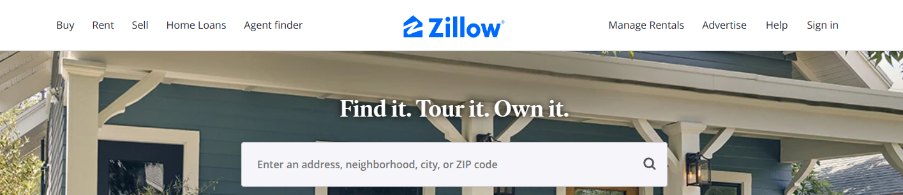

Udown is a mobile application that I created as an individual project in ICS 491, Spring 2021. The project helped me learn how to design and implement a cross-platform app.

Udown is implemented using [React Native](https://reactnative.dev/), a JavaScript framework for building native apps. Within four weeks, I created an app that implements several features including user authentication, profile creation, swiping mechanism, real-time chat, and feedback system.

In this project I gained experience with full-stack mobile application development and associated technologies, including [Firebase](https://firebase.google.com/) for database storage and authentication, [Expo](https://expo.io/) for app development and deployment, [Socket.io](https://socket.io/) for real-time communication, and Javascript for both front-end and back-end programming.

Here is some example code to illustrate React Native use:



Source: <a href="https://github.com/Joshrlear/udown-client">Joshrlear/udown-client</a>
