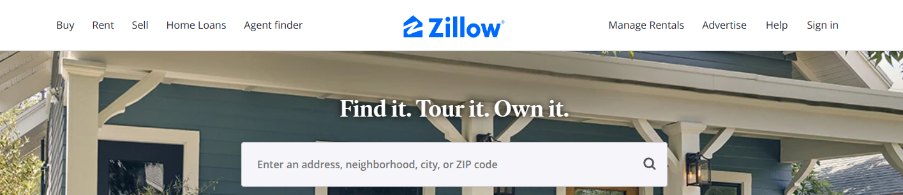

This is a server application that scrapes data from Zillow.com, one of the most popular websites used to search for homes, check home values, and find real estate agents. It uses Zillow's internal API and recursively splits the map four times to get around the 500-results-per-search limit.

## Features

- Scrapes data such as property address, price, size, bedrooms, bathrooms, year built, etc.
- Saves data to a MongoDB database
- Provides a RESTful API for querying and filtering data
- Supports pagination and sorting of results
- Handles errors and retries gracefully

## How to use

1. Clone this repo: `git clone https://github.com/Joshrlear/zillowScraper-server.git`
2. Install dependencies: `npm install`
3. Start MongoDB: `mongod`
4. Start server: `npm start`
5. Send requests to `http://localhost:3000/api/properties` with optional query parameters such as `city`, `state`, `min_price`, `max_price`, etc.

## Example request and response

Request:

`GET http://localhost:3000/api/properties?city=Seattle&state=WA&min_price=500000&max_price=1000000`

Response:

`json
{
  "total": 1234,
  "page": 1,
  "limit": 10,
  "data": [
    {
      "_id": "60f9b8a7c6e9f90015a8d6e7",
      "address": "123 Main St",
      "price": "$750,000",
      "size": "1,234 sqft",
      "bedrooms": 3,
      "bathrooms": 2,
      "yearBuilt": 1980,
      "__v": 0
    },
    {
      "_id": "60f9b8a7c6e9f90015a8d6e8",
      "address": "456 Pine St",
      "price": "$850,000",
      "size": "1,456 sqft",
      "bedrooms": 4,
      "bathrooms": 3,
      "yearBuilt": 1990,
      "__v": 0
    },
    // more properties ...
  ]
}
